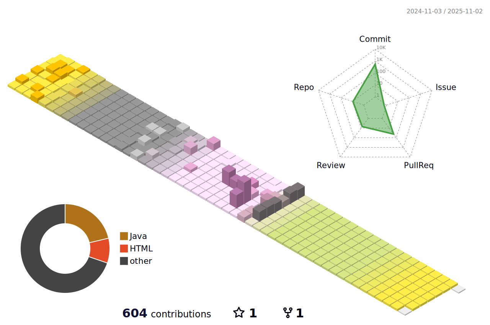

# 저는!

<!-- 
 -->

<!-- font-size 를 조절하면 원하는 크기로 글자를 조절할 수 있습니다.-->
  <!-- Designed and developed in-house at Oreuda (https://oreuda.kr) -->
  <!-- 불편 사항 및 문의는 tykimdream@gmail.com으로 보내주세요 -->
  

    

          <h3 style ="font-size : 1.5em; font-weight:700;">
          I am
          </h3>
          
안녕하세요. 다양한 경험을 즐기는 개발자입니다.👩‍💻

    

  

  
  

    <h3 style ="font-size : 2em; font-weight:700;">💙hit💙</h3>
    

      <!---->
    

  

  
  <!-- div key="6">
    <h3 style ="font-size : 2em; font-weight:700;">Git Stats</h3>
    
  

  

    
    
  

  

    <h3 style ="font-size : 2em; font-weight:700;">Algorithm Stats</h3>
    
    
  

  
  

  <h2 style ="font-size : 2em; font-weight:700;">Tech Stack</h2>
    
<h3 key=0 style ="font-size : 1.5em; font-weight:700;">백엔드</h3>
         
<h3 key=1 style ="font-size : 1.5em; font-weight:700;">Infra</h3>
   
<h3 key=2 style ="font-size : 1.5em; font-weight:700;">협업툴</h3>
 
<h3 key=3 style ="font-size : 1.5em; font-weight:700;">디자인</h3>

  

  
  

    <h2 style ="font-size : 2em; font-weight:700;">💜Contact💜</h2>
    

      
      
      
    

  

# 오르다 성장 차트📈 (Updated 23.07.10)

